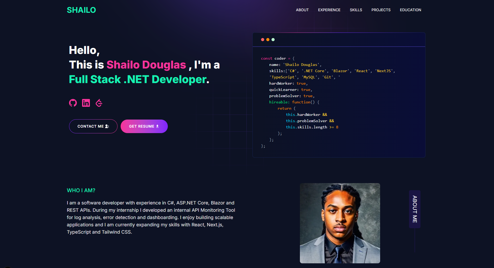

<h1 align="center">Shailo Douglas Portfolio</h1>

<p align="center">
  
</p>

<p align="center">
  <strong>Full Stack Software Developer Portfolio built with Next.js and Tailwind CSS</strong>
</p>

<p align="center">
  
  
  
</p>

<p align="center">
  <a href="https://shailo-douglas-portfolio.vercel.app"><strong>🚀 Live Demo</strong></a>
</p>

---

# Portfolio Preview


🚀 Live Demo:
https://shailo-douglas-portfolio.vercel.app

---

# About

This repository contains my personal developer portfolio where I showcase projects, technical skills and software engineering experience.

The portfolio includes:

- API Monitoring Tool internship project  
- Zoo Management Application  
- Deckxio Kulturu live e-commerce website  
- Developer Analytics Dashboard (in progress)  
- Skills, experience and education overview  
- Contact section and resume access

---

# Featured Projects

## API Monitoring Tool
Full stack monitoring platform built during my internship for API log analysis, error detection and dashboard monitoring.

**Tech used**
- C#
- ASP.NET Core
- Blazor
- REST APIs
- SQL Server
- Entity Framework
- JWT
- xUnit
- Playwright

---

## Zoo Management Application
ASP.NET Core MVC application for managing animals, enclosures and feeding logic.

Features:
- CRUD operations  
- Auto assignment strategies  
- Validations  
- xUnit tests

**Grade achieved:** 9.1

GitHub Repo:  
https://github.com/KingSD0/ZooApp

---

## Deckxio Kulturu E-commerce Website
Live e-commerce website focused on branding, product presentation and online sales.

Live Website:  
https://www.deckxiokulturu.nl

---

## Developer Analytics Dashboard *(In Progress)*
Building a modern dashboard for developer metrics and project insights.

Tech:
- React  
- Next.js  
- TypeScript  
- Tailwind CSS  
- REST API

---

# Tech Stack

Frontend
- Next.js
- React
- Tailwind CSS
- JavaScript
- Sass

Backend / Other
- ASP.NET Core
- Blazor
- C#
- SQL Server
- Entity Framework
- Git / GitHub
- Vercel

---

# Run Locally

```bash
git clone https://github.com/KingSD0/Developer-portfolio.git
cd Developer-portfolio

npm install
npm run dev
```

Open:

```bash
http://localhost:3000
```

---

# Contact

**LinkedIn**  
https://www.linkedin.com/in/shailo-douglas/


---

Built by **Shailo Douglas**